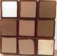
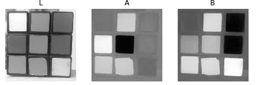

<h1 align=center>Image Coloration Website</h1>

The main purpose of this website is to colour black and white images with a conditional Generative Adversarial Network and 3 Discriminators.

## Description

#### Pix2Pix Algorithm

- GANs are generative models that learn a mapping from random noise vector z to output image y, G : z → y [24]. In contrast, conditional GANs learn a mapping from observed image x and random noise vector z, to y, G : {x, z} → y. 
- The generator G is trained to produce outputs that cannot be distinguished from “real” images by an adversarially trained discriminator, D, which is trained to do as well as possible at detecting the generator’s “fakes”
- Black and white image resized to (256,256) is feed into the generator trained against 3 discriminator which output the A channel(colour balance between Green and Magenta) and B channel(colour balance between Blue and Yellow) of LAB colour space where L channel (Lightness) is the original Black and White Image itself.

## 							                                    
